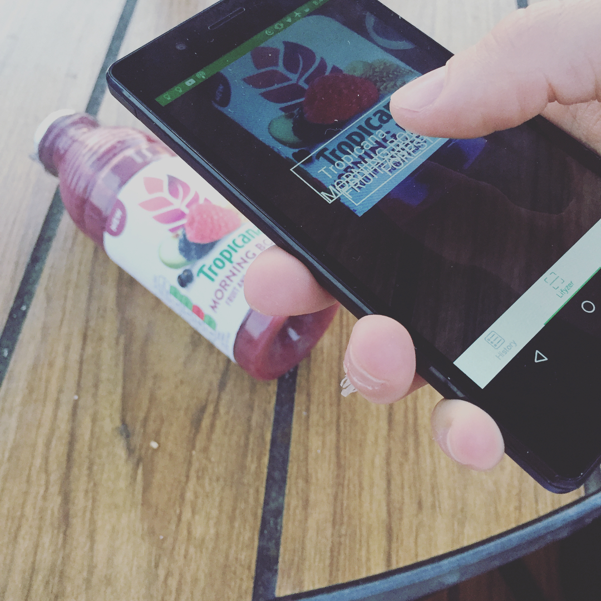
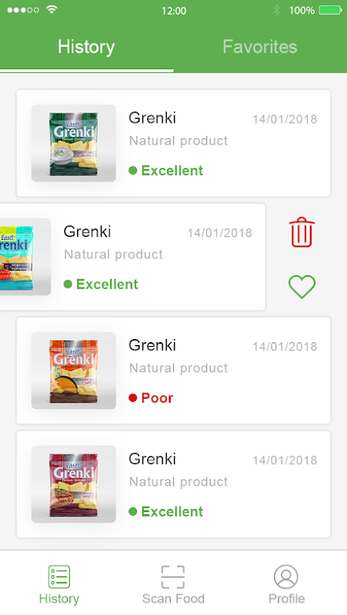
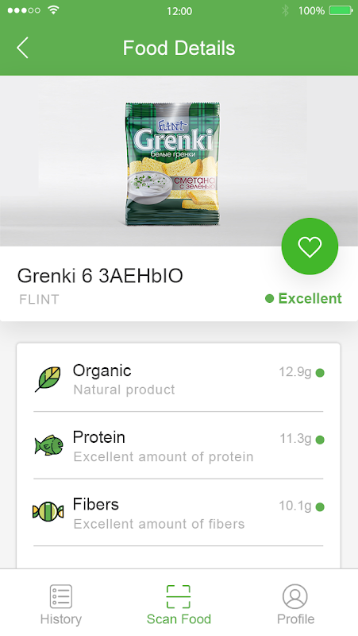

# Android Food Scanner App

*The native, Android [Food Scanner App](https://play.google.com/store/apps/details?id=com.lifyzer) 🥝*

## About The App 🤔

* Lifyzer App uses OCR and barcode scanner technologies.

## Yummy Features 😋

This Food Scanner Android App lets you:

- Scan any items with QR codes, barcodes, Optical Character Recognition (OCR).
- Favorite the good products you want to highlight.
- See all scanned products in the history section.
- See all information about the item (with lovely icons).
- Directly be able to see if the product is **good** (healthy) or **bad** (unhealthy).

## The Founder 👨‍🍳

🍓 [Pierre-Henry, App Founder](http://pierrehenry.be), Passionate about healthy food, healthy life, and programming.  🍍

## Yummy Screenshots 😍

